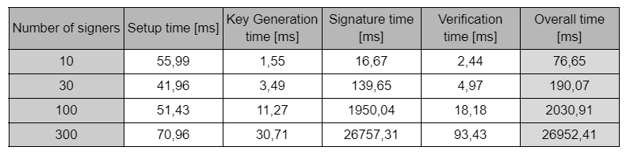
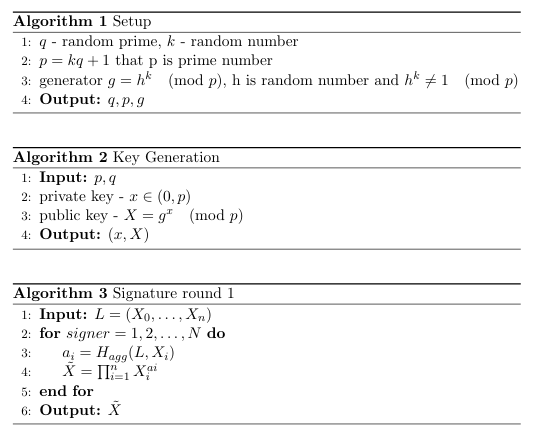
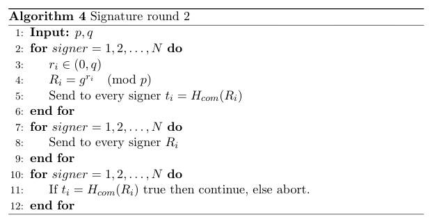
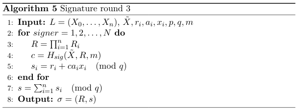
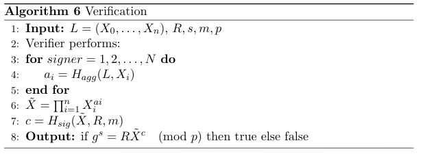

<!-- MARKDOWN LINKS & IMAGES -->

[status-icon]: https://img.shields.io/badge/status-active-success.svg
[project-url]: https://github.com/DamianTab/schnorr-multi-signatures
[issues-icon]: https://img.shields.io/github/issues/DamianTab/schnorr-multi-signatures.svg
[issues-url]: https://github.com/DamianTab/schnorr-multi-signatures/issues
[pulls-icon]: https://img.shields.io/github/issues-pr/kylelobo/The-Documentation-Compendium.svg
[pulls-url]: https://github.com/DamianTab/schnorr-multi-signatures/pulls
[license-icon]: https://shields.io/badge/license-Apache%202-blue.svg
[license-url]: /LICENSE
[author-url]: https://github.com/DamianTab

<p align="center">
  <a href="" rel="noopener">
 </a>
</p>


<h3 align="center">Schnorr Multisignature</h3>

<div align="center">
  
  [![Status][status-icon]][project-url]
  [![GitHub Issues][issues-icon]][issues-url]
  [![GitHub Pull Requests][pulls-icon]][pulls-url]
  [![License][license-icon]][license-url]
</div>

---

<p align="center"> Schnorr Multisignature for Bitcoin and other cryptocurrencies
    <br> 
</p>

## 📝 Table of Contents
- [About](#about)
- [Technologies](#technologies)
- [Getting Started](#getting_started)
- [Background](#background)
- [Usage](#usage)
- [Deployment](#deployment)
- [Authors](#authors)
- [Acknowledgments](#acknowledgement)

<br/>

## 🧐 About <a name = "about"></a>
Implementation of Schnorr multi-signature presented in [Maxwell Schnorr Multisignature, 2019](articles/2019,%20Maxwell-DCC-Schnorr%20Multisignature.pdf) article based on [Schnorr Signature](articles/Schnorr1991_Article_EfficientSignatureGenerationBy.pdf) for Bitcoin and other cryptocurrencies purposes.

Main idea and concept of this solution are explained in this [PRESENATATION](presentation_schnorr_multi_sig.pdf) .

All work and necessary details are presented in project report: [MULTISIG-REPORT](report/report.pdf).
The most important informations are places in project summary: [MULTISIG-SUMMARY](report/report-summary.pdf).


<br/>

## ⛏️ Technologies <a name = "technologies"></a>
- Python v3

<br/>
  
## 🏁 Getting Started <a name = "getting_started"></a>
These instructions will help you set up and run project on your local machine for development and testing purposes. See [deployment](#deployment) for notes on how to deploy the project on a live system.

<br/>

### Prerequisites

What things you need to install the software and how to install them.
```
python v3
```

Python packages:
```
sympy
hashlib
```

The easiest way to install all libraries is to type:
```
pip3 install <package>
```

### Running

To run code type with optional parameters `<message_content>` and `<number_of_signers>`:
```
python3 multi-sig.py
python3 multi-sig.py <message_content> <number_of_signers>
```


<br/>

## 🔧 Background <a name = "background"></a>

### Theory
**Information below can be also found in separate document as a project summary: [MULTISIG-SUMMARY](report/report-summary.pdf).**

**Abstract**. ECDSA (Elliptic Curve Digital Signature Algorithm) is the current digital signature scheme for Bitcoin. The Schnorr signature algorithm, although still lacking a standardization, is superior in every aspect to ECDSA. This work presents a new Schnorr-based multi-signature scheme called MuSig which makes use of key aggregation and is provably secure in the plain public-key model.

**Introduction**. Multi-signatures are a form of technology used to add multiple participants to cryptocurrency transactions. The Schnorr multi-signature technology provides a fairly simple and neat solution of combining digital signatures and keys where multiple signers with their own public and private keys sign one message. This means that instead of generating an individual signature for each new bitcoin transaction, signatories can only use one signature. 

**Digital Signature**. A digital signature is used to validate the authenticity and integrity of a message or digital document. It's the digital equivalent of a handwritten signature but it offers far more inherent security. Basically the signer signs a hashed message with his private key and sends the signed message along with his public key and the plaintext message to the receiver so the receiver can verify if the message has not been modified or the signer is the real sender. 

**Schnorr Signature**. Schnorr signature is a digital signature which is secure under discrete logarithm problem. Like ECDSA, Schnorr also uses the same private-public key pairs. The only difference is in the signing and verification algorithm, which happens to be a lot simpler than ECDSA as it is linear. Here, we have a cyclic group 𝔾 = <𝘨> of prime order 𝘱 and a random secret key sk ∈ ℤ𝘱. To sign a message 𝑚, we pick r ∈ ℤ𝘱 randomly and compute R =  𝘨r, c = 𝐻 (𝑿, R, 𝑚), s = r + c𝒙 mod 𝘱. Then the signature is σ =(R,s).

**Multi-signature**. A multisignature scheme allows a group of signers to produce a joint signature on a common message, which is more compact than a collection of distinct signatures from all signers. Given this signature and the list of signers’ public keys, a verifier is able to check if every signer in the group participated in signing.

**Naive Schnorr Multi-signature**. Based on key aggregation property of 𝑿 = 𝜫ni=1 𝑿i and R = 𝜫ni=1 Ri  But it is not secure under cancellation problem. 
Rogue Key Attack. Multisignature schemes have to be secure against the rogue key attack where an adversary chooses his public key as a function of public keys of honest users.

**Bellare and Neven Multi-signature**. The Bellare-Neven scheme prevents rogue key attack by having a distinct challenge ci for each signer in its partial signature si = ri + ci𝒙i ,ci = 𝐻 (❬L❭, 𝑿i, R, 𝑚). However, key aggregation is no longer possible since the entire list of public keys is required for verification 𝘨s = R𝜫ni=1𝑿ici.

**Maxwell Multi-signature**. It is a variant of the BN scheme based on schnorr multi-signature with key aggregation and distinct challenge property where 𝑿 = 𝜫ni=1𝑿i ,
 ci = 𝐻agg (❬L❭, 𝑿i). 𝐻sig (𝑿, R, 𝑚) ,  ai = 𝐻agg (❬L❭, 𝑿i)

**Applications to Bitcoin**. Fraudulent actions such as hacking have become increasingly common as cryptocurrency has grown in popularity. Many businesses have implemented multi-signature agreements for their transactions in order to limit fraudulent activity because it provides a higher level of security. For example, Lightning-network-channel and Multisig-wallet are some examples of multi-signature applications in Bitcoin.

**Implementation**. We implemented the Schnorr multi-signature in Python 3.0 because of the convenience with large numbers and Due to limited resources, we considered fewer restrictions.

**Results**. Here, you can see the difference in runtime depending on different number of signers:

<div align="center">


</div>


**Conclusion**. The purpose of this report is to provide an introduction to the Schnorr signature algorithm and describe some of its amazing applications to bitcoin and the benefits and improvements that would result from its implementation. Improved efficiency and privacy are the benefits that Schnorr would bring to Bitcoin. 


### Algorithms
Implemented phases of the Schnorr multi-singature are presented in that particular order:

<div align="center">

  
  
  
  
</div>

<br/>

## 🎈 Usage <a name="usage"></a>
Project simulates the correspondence between signers in main function. No additional work is no need to run/simulate the possibilities of this multi-signature. All necessary functions are available to use in your own code.

It is possible to change number of bits for prime numbers, but it is highly discouraged. It can produce unexpected errors.

<br/>

## 🚀 Deployment <a name = "deployment"></a>
No availab  le deployment method.

<br/>

## ✍️ Authors <a name = "authors"></a>
- [@DamianTab][author-url] - implementation and algorithms
- [@pariaighanian](https://github.com/pariaighanian) - concept and presentation

<br/>

## 🎉 Acknowledgements <a name = "acknowledgement"></a>
We would like to thank our supervisor, Dr. Rajeev Anand SAHU from Université du Luxembourg (University of Luxembourg),
for his valuable discussions and feedback.